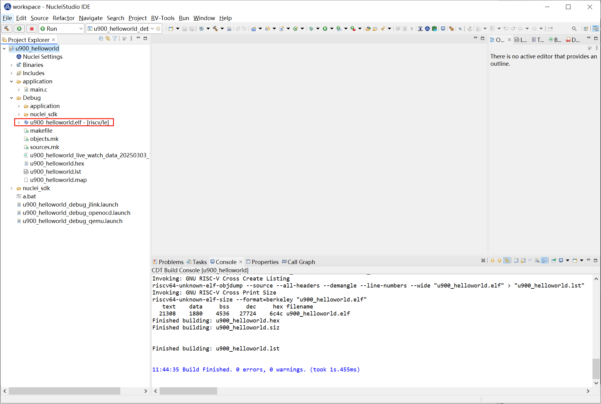
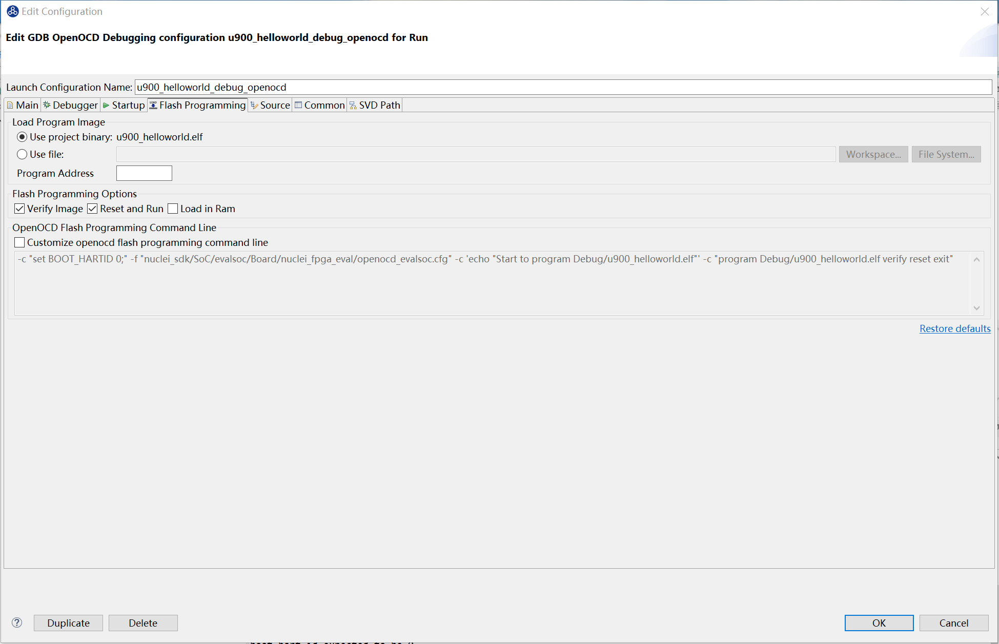

# Flash Programming

为了满足用户将编译好的二进制文件直接下载到硬件开发板的需求，Nuclei Studio 提供了 **Flash Programming** 功能。该功能允许用户快速、便捷地将编译好的二进制文件直接下载到硬件开发板中，极大提升了开发和调试的效率。用户只需点击一次即可完成二进制文件的下载，简化了操作流程。

## 解决方案

### 环境准备

**Nuclei Studio**：

要求版本 >= 202412，下面提供202502版本。

- [NucleiStudio 202502 Windows](https://download.nucleisys.com/upload/files/nucleistudio/NucleiStudio_IDE_202502-win64.zip)
- [NucleiStudio 202502 Linux](https://download.nucleisys.com/upload/files/nucleistudio/NucleiStudio_IDE_202502-lin64.tgz)

### Flash Programming 使用演示

**step1：导入 Nuclei SDK 原始工程和烧写开发板**

优化前的工程下载链接 [u900_helloworld.zip](u900_helloworld.zip) 

bit文件 [trace-u900_best_config_ku060_16M_e85631d489_e82e2771f_202409232110_v3.12.0.bit](..\Documents\WXWork\1688856563310943\Cache\File\2024-12\trace-u900_best_config_ku060_16M_e85631d489_e82e2771f_202409232110_v3.12.0.bit) 

下载 zip 包后，可以直接导入到 Nuclei Studio 中运行 (导入步骤：`File->Import->Existing Projects into Workspace->Select archive file->选择zip压缩包->Finish`即可)。

给ku060开发板烧写上面的bit文件。

**step2：配置Flash下载模式**

点击项目Nuclei Settings打开配置页面，选中Download模式，改为FLASH，点击Save settings保存。

**step2：配置编译 Nuclei SDK 原始工程**

编译原始工程，确保编译成功以及在 Debug 下可以找到生成的 elf 文件：

**step3：配置Flash Programming选项卡**

在Launch Configuration 选中对应调试选项(openocd)，点击edit打开配置页面。

选择 **Flash Programming** 选项卡，进入配置页面。

现在这里按照默认配置即可，点击OK。（有其他需要可自行配置）

- **Load Program Image** 

  默认情况下，**Flash Programming** 会加载 `.elf` 格式的文件。用户也可以选择加载其他格式的文件，包括：`*.bin``*.hex``*.s19``*.srec``*.symbolsrec`

- **Flash Programming Options**：

  **Flash Programming**提供了以下三种选项：

  - **Verify Image**：选中此选项后，Download 命令会带上 `verify` 参数。该参数用于确认要烧录的镜像文件是否匹配当前连接的目标设备上的闪存配置。
  - **Reset and Run**：选中此选项后，Download 命令会带上 `reset` 参数。该参数会在执行完 `load` 后强制系统复位（SRST），并让目标设备运行。
  - **Load in Ram**：选中此选项后，用户需要指定 **Program Address**。Download 命令会带上 `resume {Program Address}` 参数，该参数会将固件加载到内存中，而不是闪存中。

- **OpenOCD Flash Programming Command Line**

  所有的配置参数最终会以命令行的形式通过 GDB 执行。用户也可以自定义所需的命令，只需勾选 **Customize openocd flash programming command line**，即可在下方输入框中输入自定义命令。

**step4：下载**

鼠标右键项目，选择Flash Programming选项，下载二进制文件到硬件开发板。

下载成功后，用户可以在 **Console** 中看到下载结果，确认二进制文件已成功烧录到硬件中。

### 总结

**Flash Programming** 功能为用户提供了一种快速、便捷的方式将编译好的二进制文件下载到硬件开发板中。通过简单的配置，用户可以轻松适配不同的硬件环境，并确保二进制文件的正确烧录。

